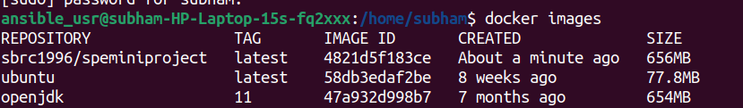
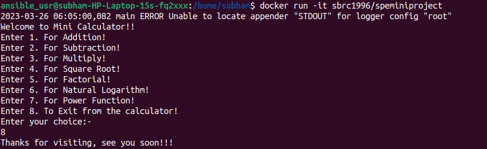
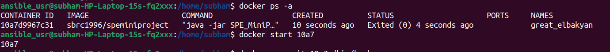
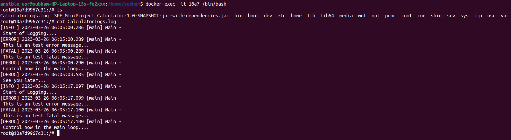
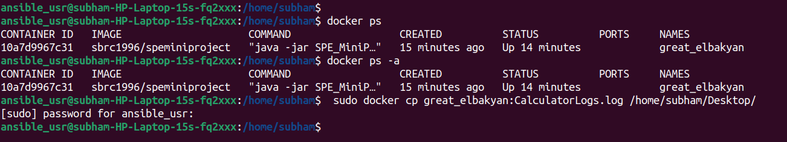

# SPE_Calculator....

This repository is used to implement a calculator like app using Java 11. Here we show the usecase of how to build a sample project in Java and then Use a VCS like Git & GitHub. Moreover develop a CI pipeline using Jenkins and GitSCM polling to design the continous pipelines for seamless development and testing. Also we use JUnit for writing the unit test cases and Maven for building the entire project. We use Docker for the containerization purpose and Ansible for Configuration Management. We also use the ELK stack here...

Steps to Run the Program..

0. Provide sudo priviledges to docker daemon program: `sudo chmod 666 /var/run/docker.sock`
1. Run ngrok: `ngrok http 8080` (since 8080 is the port number for Jenkins)
2. Copy the https ip address generated from the ngrok and copy it to GitHub Webhooks (Payload URL) and Configure Jenkins (Jenkins URL)
3. In github webhook payload URL copy it with extra tag of /github-webhook/ ---> <Https Ip address>/github-webhook/   e.g. http://f39e-103-156-19-229.ngrok.io/github-webhook/
4. Push some changes to Github from the IDE, and a build will start.
5. Before running a build make sure the no docker images are running.
6. login as Ansible user: `sudo su ansible_usr`
7. check the created docker images: `docker images`
    
8. run the latest created docker image: `docker run -it sbrc1996/speminiproject`
    
9. Start the container:  `docker start <Container_Id>`
    
10. Go inside the container and check the contents: `docker exec -it 10a7 /bin/bash`
    
11. Copy the log from the Docker Container to the Host desktop using: `sudo docker cp great_elbakyan:CalculatorLogs.log /home/subham/Desktop/`
    
12. Upload the file to the online cloud [ELK](https://cloud.elastic.co/home) stack ..
13. Done!!!

